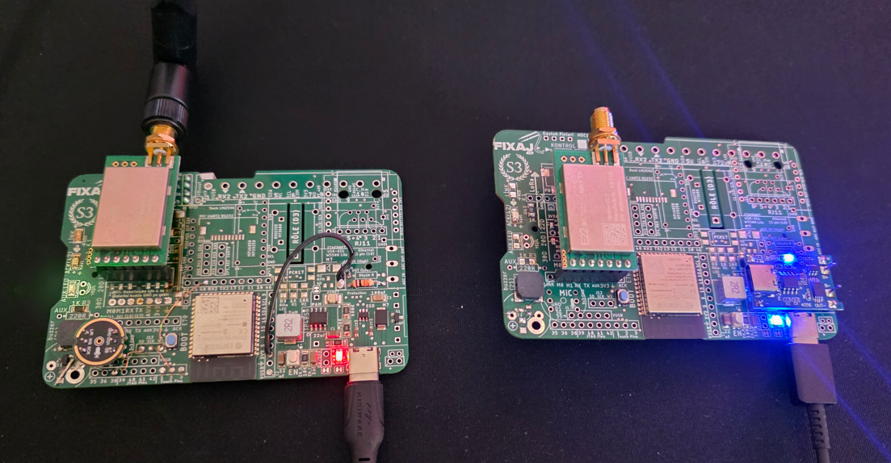
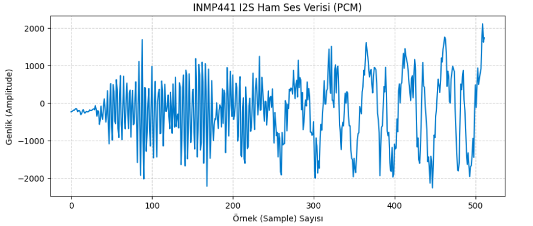

# 📻 End-to-End RF Audio Streaming System (ESP32 S3 & LoRa E22)


Bu proje, bir INMP441 MEMS mikrofon üzerinden alınan **16kHz, 16-bit** ham PCM ses verisini, dar bantlı (narrow-band) bir RF modülü olan **LoRa E22** üzerinden iletmek ve alıcı tarafta yeniden birleştirerek (Reassembly) bilgisayar ortamında `.wav` formatına dönüştürmek amacıyla geliştirilmiş endüstriyel bir Gömülü Sistem mimarisidir.

Sistem; eşzamanlı donanım yönetimi, veri parçalama (fragmentation), paket kayıp oranı (PLR) hesaplaması ve asenkron zaman aşımı (non-blocking timeout) gibi ileri seviye mühendislik konseptlerini barındırır.

# 📡 ESP32 S3 I2S Audio over LoRa

> **32ms'lik kristal net ses — DMA ile kaydedilir, LoRa E22 ile iletilir.**

Bir INMP441 MEMS mikrofon, bir ESP32 S3 ve bir LoRa E22 modülü ile gerçek zamanlı ses verisi kablosuz aktarımı. Sıfır CPU yükü, sıfır gecikme tasarımı.

---

## 🏗️ Mimari Genel Bakış

```
[INMP441 Mikrofon]
      │  I2S (Philips Std)
      ▼
[ESP32 S3 — I2S DMA Donanımı]
  32-bit fiziksel hat → 16-bit DMA dönüşümü (donanımsal, CPU yok)
      │  512 örnek × 16-bit = 1024 byte
      ▼
[pcm_buffer — SRAM]
      │  Paketlere bölünür (5 × 210 byte)
      ▼
[LoRa E22-900T22D]
  Adresli gönderim → Karşı Alıcı
```

> [!NOTE]
> Gönderici kodun Kütüphane versiyonuda eklenmiştir. (kütüphane haline getirilmiş v2/library) Aynı kod sadece okuması daha kolaydır. Projeyi modüler hale getirmek için Nesne Yönelimli Programlama (OOP) mantığıyla bir sınıf (Class) yazmak en doğrusudur.
 
---

## 🎥 Proje Tanıtım Videosu

[](https://www.youtube.com/watch?v=YlLklpSxGew)

> 🎬 Videoyu izlemek için görsele tıklayın
 
 

## 🎙️ Ses Kayıt Tasarımı

### Neden `driver/i2s_std.h`?

Arduino'nun standart `ESP_I2S.h` kütüphanesi yerine **Espressif'in doğrudan sürücüsü** tercih edildi.  
Bu sayede DMA descriptor sayısı, frame boyutu ve donanım dönüşümleri doğrudan kontrol edilebiliyor.

### 32-bit → 16-bit Donanımsal Dönüşüm

INMP441, sesi **24-bit çözünürlükte** üretir. I2S protokolü bu veriyi **32-bitlik slot** içinde taşır.  
`int24_t` diye bir C tipi olmadığından ve LoRa bandını verimli kullanmak gerektiğinden, donanım katmanında MSB kesme yöntemi kullanıldı:

```cpp
// DMA'ya: "Bana 16-bit ver"
.slot_cfg = I2S_STD_PHILIPS_SLOT_DEFAULT_CONFIG(I2S_DATA_BIT_WIDTH_16BIT, ...)

// Donanıma: "Fiziksel hattı 32-bit dinle"
std_cfg.slot_cfg.slot_bit_width = I2S_SLOT_BIT_WIDTH_32BIT;
```

**Sonuç:** ESP32 S3 DMA birimi, gelen 32-bit veriyi alır → alt 16 biti atar → sesin karakterini taşıyan üst 16 biti (MSB) doğrudan RAM'e yazar. CPU hiç dahil olmaz.

### Çerçeve Boyutu: 32ms

```
16.000 Hz × 0.032 s = 512 örnek (tam sayı, kesir yok)
512 × 2 byte = 1024 byte / çerçeve
```

---

## ⚙️ DMA & Durum Makinesi

### Neden DMA?

- İşlemci hiç yorulmaz — kayıt arka planda gerçekleşir
- Buffer dolduğunda donanım otomatik olarak callback tetikler
- Callback içinde yalnızca **flag güncellenir** (WDT güvenli)
- Asıl işlem ana döngüde yapılır → çökme riski sıfıra yakın

### State Machine

```
STATE_IDLE
    │  i2s_channel_read() başlatılır
    ▼
STATE_RECORDING
    │  DMA arka planda 1024 byte doldurur
    │  [ISR] on_recv_done() → flag
    ▼
STATE_FRAME_READY
    │  I2S kanalı kapatılır
    ▼
STATE_PROCESSING
    │  Paketleme + LoRa gönderimi
    ▼
STATE_ERROR  (overflow veya donanım hatası)
```

`switch/case` yapısı Assembly katmanında **sıfır performans kaybıyla** durum geçişi yapar.

---

## 📦 LoRa Paket Yapısı

1024 byte ses verisi **5 pakete** bölünerek gönderilir:

```c
#pragma pack(push, 1)
struct AudioPacket {
    uint32_t cerceve_no;              // 4 byte  — senkronizasyon
    uint16_t kaynak_id;               // 2 byte  — cihaz kimliği
    uint8_t  veri_uzunlugu;           // 1 byte  — gerçek veri boyutu
    uint8_t  paket_no;                // 1 byte  — sıra numarası
    uint8_t  toplam_paket;            // 1 byte  — toplam paket sayısı
    char     sifre[10];               // 10 byte — erişim denetimi
    int16_t  ses_verisi[105];         // 210 byte — PCM verisi
};  // TOPLAM: 229 byte
#pragma pack(pop)
```

`#pragma pack(push, 1)` ile struct hizalaması garantilendi — platform bağımsız doğru boyut.

---

## 📡 LoRa E22 Dinamik Yapılandırma

> Bu kütüphane ve PCB tasarımı **[Fixaj Teknik](https://github.com/fixajteknik/YouTube_Tutorials)** tarafından geliştirilmiştir.

Standart LoRa modülleri parametre ayarları için harici bir programlayıcı gerektirir.  
Bu tasarımda modül **yazılım üzerinden dinamik olarak yapılandırılır**:

- ✅ Ekstra programlayıcı donanım gerekmez
- ✅ Modül değiştirildiğinde sistem kendini yeniden ayarlar
- ✅ Adres, frekans ve şifre bilgisi donanıma gömülü değil, kodda yönetilir
- ✅ Saha kullanıcısı için sıfır konfigürasyon yükü

Referans proje ve PCB şemaları:  
🔗 [Video 108 — #define Part 2 / RSSİ li E22-900T22](https://github.com/fixajteknik/YouTube_Tutorials/tree/main/Video%20108%20%23define%20Part%202/RSS%C4%B0%20li%20e22900t22)

---

## 🔌 Donanım Bağlantıları (ESP32-S3 İçin)
> **Not:** Klasik ESP32'de Input-Only pinlerine (34-39) WS/SCK bağlanamaz. S3 için en güvenli pinler 1, 2 ve 3'tür.

| INMP441 Mikrofon | ESP32-S3 (TX) Pin | Açıklama |
| :--- | :--- | :--- |
| VDD / GND | 3.3V / GND | Güç Beslemesi |
| L/R | GND | Sol Kanal Seçimi |
| WS | GPIO 1 | Word Select (LRCK) |
| SCK | GPIO 2 | Serial Clock (BCLK) |
| SD | GPIO 3 | Serial Data (DIN) |

| LoRa E22 Modülü | ESP32-S3 (TX/RX) Pin |
| :--- | :--- |
| M0 / M1 | GPIO 4 / GPIO 6 |
| TX / RX | GPIO 17 / GPIO 18 |

---

## Ses Verisi (Ham PCM) ve Dalga Formu

INMP441 üzerinden alınan 512 örnekten (sample) oluşan 16-bit ham ses verisi tamponu (buffer) aşağıda listelenmiştir. 



<details>
<summary><b>Ham Ses Verisini (Buffer) Görmek İçin Tıklayın</b></summary>

```python
# Ham ses verisi (512 örnek)
raw_data = [
    -239, -223, -213, -194, -194, -166, -153, -163, -235, -207, -202, -229, -315, -283, -217, -176, 
    -243, -273, -247, -228, -239, -240, -223, -186, -206, -205, -189, -167, -161, -182,  -73, -173, 
    -356, -208, -225, -573, -457,  -86, -359, -440,  -96,  109, -171, -512, -293,  326, -530, -1093, 
      90,  518, -636, -994,  486,  306, -484, -554,  622,  362, -684, -925,  199,  730, -580, -981, 
     -58,  714, -506, -694,  142,  530, -215, -687,  264,  345, -911,  -69,  333, -583, -550,  115, 
     565, -511, -1592,   -7, 1111, -555, -1937, -101, 1693, -924, -2034,  407,  397, -1293, -798,  -37, 
     384, -695, -1151,  -32,  973, -738, -1469,   77,  576, -536, -1445,   25,  267,  365, -823, -808, 
     586,  330, -1150, -405,  500, -219, -221,  -65,  213, -362, -689,  285, -197, -812,  507, -275, 
    -648,  687, -630, -379, -296, -669,  538,  420, -1650, -955,  428,  747, -1026, -1683,  879,  740, 
    -1496, -677,  780,  -88, -1058, -751,  278,  366, -792, -1232, 1183,  648, -1444, -723, 1031,  748, 
    -1259, -1065, 1089,  556, -1612, -573, 1049,  315, -2226, -506,  905, -360, -1478, -822,  598, -505, 
    -1007, -593, -415, -447,    3, -382, -681, -194,  -51, -110, -641,  375, -547,  344,  259, -1328, 
    -567,  944,  303, -884,   94,  847,  -62, -363,  746, -440, -347,  -49,  527,  404, -1017, -891, 
     299,  703, -1392, -1441, -254,  138, -1492, -1614,  427,  -92, -1222, -1171,  -70,  125, -759, -659, 
     -12,  798, -338, -710,  369,  658,  245, -321,  -31, 1245, -193, -182,  685,  378,  -92, -490, 
      42,   37, -590, -233,  321, -195,  146,  175, -118,  373, -360, -1070, -255, -543, -877, -784, 
    -1443, -813, -954, -1845, -1924, -789, -1120, -1096, -1086,   63,  -28, -748,  -40, -147,  366,  319, 
     401,  377,  238,  873,  464,  117,  508,  604,  160, 1141,  410,  679,  614, -182,  281, -714, 
    -507, -114,   81,  -83,  560,   83,  385,  166, -781, -779, -863, -847, -501, -1777, -2012, -935, 
    -1149, -1873, -1549, -1745, -905, -573, -729, -257,   45,  596,  -29,  -28,  322,  380,  990, 1441, 
     550,  259, 1514,   70,   68, -122,  873, 1016,  268,  907,  983,  372, -564, -788, -1249, -670, 
    -517, -615, -120,  263,   -8,  302,  268, -345, -611, -611, -1259, -1480, -1518, -1977, -1481, -1755, 
    -1862, -1471, -1001, -814, -797,  -96, -191, -291,  299,  440,  877,  746, 1240, 1612, 1401, 1236, 
     950,  696,  824,  896,  494,  268,  715,  951,  929,  887,  510, -276, -450, -796, -1946, -1152, 
    -645, -615, -120,  437,  295,  956,  219, -752, -880, -784, -1446, -1812, -1829, -1188, -1981, -1909, 
    -1101, -1230, -1202, -428, -773,  322,  509,    0,  500,  542,  987, 1325,  926, 1451, 1266, 1152, 
    1052,  837,  518,  295,   63,  655,  728,  138,  739, 1164,  872, -458, -1176, -935, -1515, -1614, 
    -1259, -450,  441, 1083,  448,  419,  -88, -374, -716, -1572, -1444, -1714, -2145, -1425, -1555, -2270, 
    -1632, -858, -929, -351, -129,  285,  634,  476,  281,  613, 1202, 1096, 1440, 1589, 1762, 1708, 
    1342,  443,  850,  714,   33,   -5,  635,  821,  983,  904,  842, -152, -771, -1319, -1795, -1817, 
    -1589, -506,  504,  353,  703,  872,   80, -204, -717, -1330, -1645, -1336, -1692, -1968, -1695, -1677, 
    -1363, -946, -1456, -262,  482, -121,  463,  934,  497,  645,  795,  912, 1685, 2116, 1626, 1739
]
```

</details>


## 🛠️ Kurulum

```bash

# Arduino IDE → Library Manager
# "LoRa_E22" ara ve yükle
```

`gizli.h` dosyasında kendi adres ve kanal bilgilerinizi girin:

```cpp
#define Adres            1    // Bu cihazın adresi
#define GonderilecekAdres 2   // Hedef cihaz adresi
#define Kanal            20   // Ortak frekans kanalı
#define Netid            63   // Ortak ağ kimliği
```

---

## 📋 Gereksinimler

- **Donanım:** ESP32 S3 N16R8 PCB by Fixaj, INMP441 MEMS mikrofon, LoRa E22-900T22D
- **Framework:** Arduino + ESP-IDF (PlatformIO veya Arduino IDE)
- **Kütüphane:** `LoRa_E22` — [xreef](https://github.com/xreef/EByte_LoRa_E22_Series_Library)

---

##  📂 Dizin Yapısı

```bash

📦 Audio_Receiver
 ┣ 📂 1_TX_Sender_Node
 ┃ ┣ 📜 TX_Audio_Sender.ino  # I2S DMA Kayıt ve RF Fragmentation
 ┃ ┗ 📜 gizli.h              # LoRa Pin ve Adres Tanımlamaları
 ┣ 📂 2_RX_Receiver_Node
 ┃ ┗📜 RX_Audio_Receiver.ino # RF Reassembly, PLR Hesabı ve Timeout Yönetimi
 ┣ 📂 3_PC_Python_Script
 ┃ ┗ 📜 ses_alici.py         # Seri Port okuma ve PCM to WAV dönüşümü
 ┗ 📜 README.md
 
 ```
 
 👨‍💻 Geliştirici
 
Mehmet Yıldız | Embedded Systems Architect

[FIXAJ.com](https://fixaj.com/) 
---

## 📄 Lisans

Bu proje MIT lisansı ile dağıtılmaktadır.


